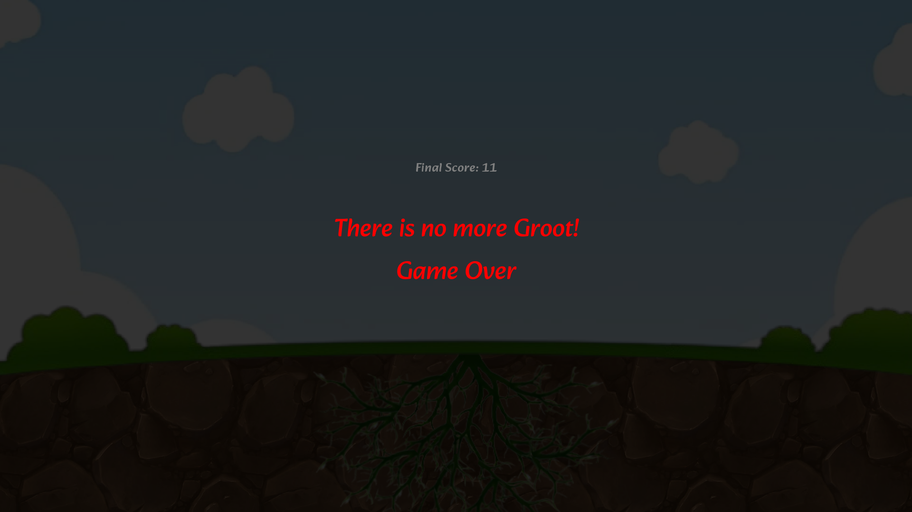

  

# Groot: Da Beginning

Grow the tree from the roots so that it bears as many fruits as possible.

This game was created as [Global Game Jam 2023](https://globalgamejam.org) project with amazing team of @xvivax, @supersigmas and @MekDrop.

Some parts aren't completed yet.

## Screenshots

## Credits

* [UI Click (sound) by EminYILDIRIM](https://freesound.org/s/536108/)
* [polyglot (translations plugin)](https://marketplace.yoyogames.com/publishers/5460/daikon-software)
* [Music composed by AIVA - Artificial Intelligence Virtual Artist](https://www.aiva.ai)
* [ASSET Pause Menu- Basic](https://marketplace.yoyogames.com/publishers/2332/jasontomlee)
* [game over (sound) by Leszek_Szary](https://freesound.org/s/133283/)
* [Game_over.wav (sound) by ????](https://freesound.org/people/deleted_user_877451/sounds/76376/)